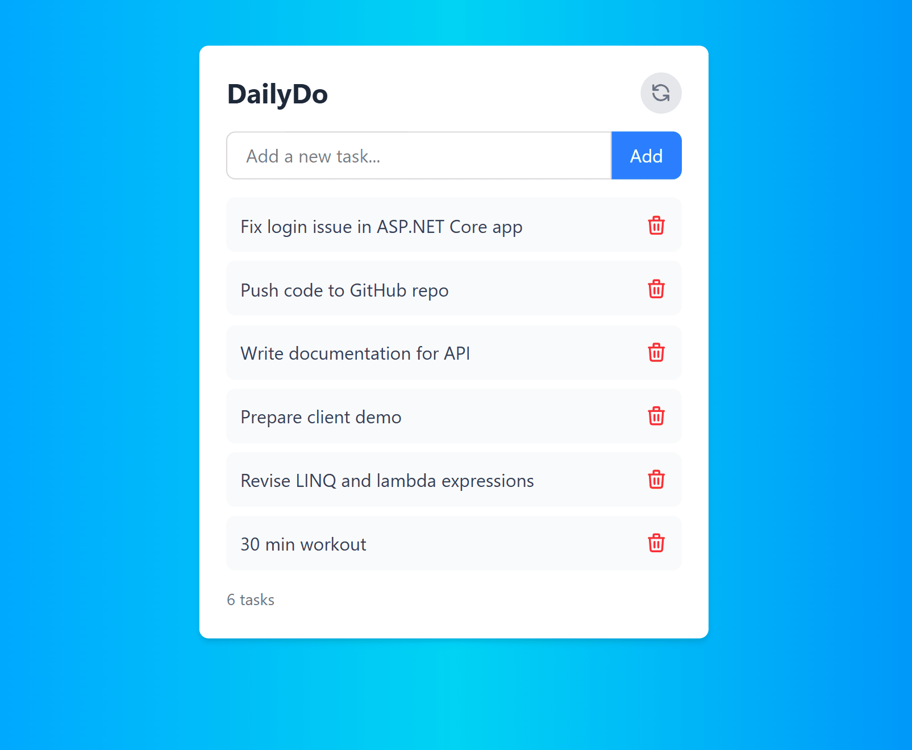

# 📝 DailyDo — Simple Todo App

**DailyDo** is a minimal and responsive Todo app built with **React** and **Tailwind CSS**. It allows users to create, edit, and delete tasks with a clean UI and intuitive interactions.

---

## 🚀 Features

- Add, edit, and delete tasks
- Inline task editing
- Keyboard support (`Enter` to add)
- Task clearing with one click
- Error handling for empty inputs
- Responsive design

---

## 🛠️ Tech Stack

- **React** (Functional components & Hooks)
- **Tailwind CSS** (Utility-first styling)

---

## 📸 Preview

---

## 📂 Getting Started

1. Clone the repository:

git clone https://github.com/MuhammadIbrahimkha/DailyDo.git

## Install dependencies:

2. npm install

## Run the app:

3. npm run dev

🙌 Author
## Muhammad Ibrahim
I'm passionate about building clean, functional, and scalable applications. Looking forward to learning and contributing to impactful projects.

